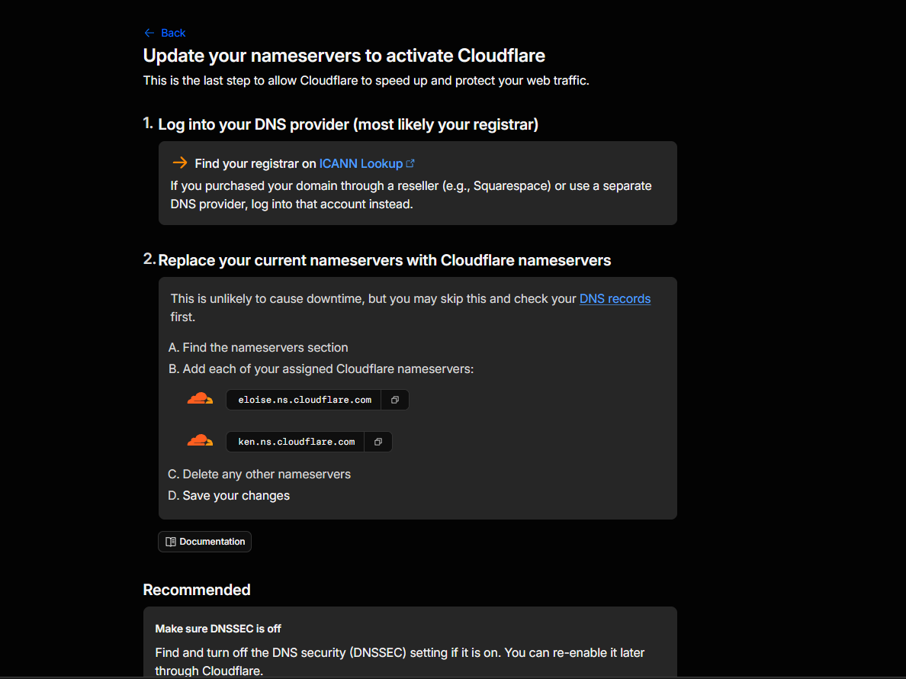
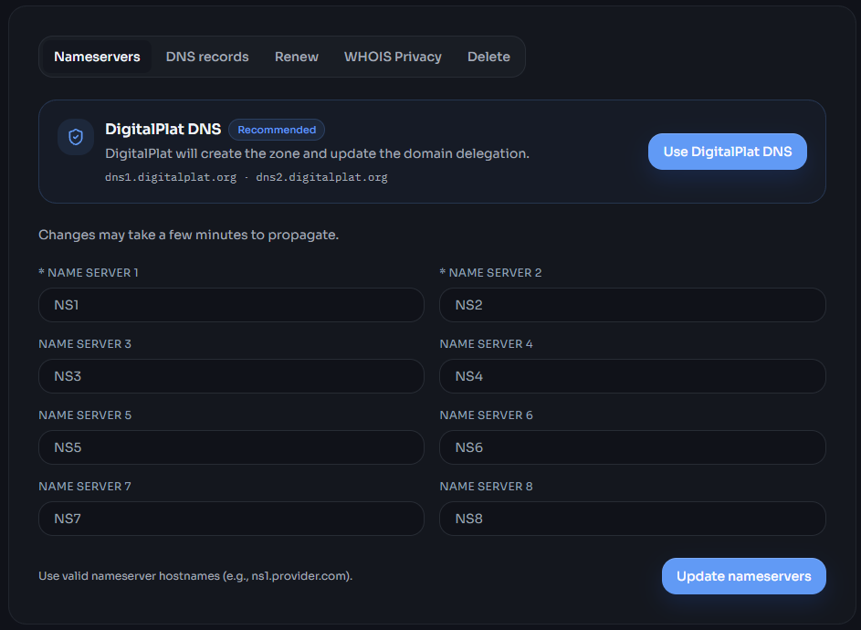
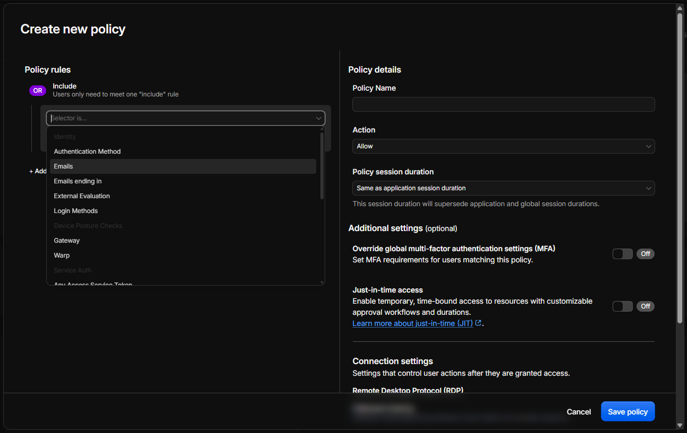

Take into account that you will need at least a card without money to get this done. (Is free but for some reason they ask you to do that)

1. Register a free domain forever
   [digitalplat](https://dash.domain.digitalplat.org/)
   - Complete the form
   - Use your github account for KYC verification.
   - Choose a name
     Your domain will probably be something like this: `name.dpdns.org`.
     _Note: Replace "name" with the name you chosen. And remember, this is "`<YOUR-DOMAIN>`"_
2. [Create a cloudflare account](https://dash.cloudflare.com/sign-up)
   _Note: Don't forget the email you used to create it_
3. Use the `setup.sh` script to setup a cloudflare tunnel.
4. Add the domain
   - **Enter to the add domain page** in cloudflare:
   - Go to `Domains > Overview`, then push the **Add domain** blue button, and select the **Connect a domain** option
     or
   - Go to `https://dash.cloudflare.com/<ACCOUNT-ID>/add-site?type=onboard`
     _Note: you will see a random sequence of numbers and characters after "dash.cloudflare.com/", that is the ACCOUNT-ID_
     _ACCOUNT-ID EXAMPLE: `f47ac10b58cc4372a5670e02b2c3d479`_
   - Put the domain name and push **Continue** blue button.
5. Select the free plan
6. Add a DNS Record
   - Click the **Add record** button, you will see a new row form to fill.
   - Fill it with this values:
     | Type Name (required) | Target (required) | Proxy status |
     | :--- | :--- | :--- | :--- |
     | CNAME | ssh | 1a2b3c4d-5e6f-7a8b-9c0d-e1f2a3b4c5d6.cfargotunnel.com | Proxied |
   - Press **save** button.
   - Press **Continue to activation** or go to `https://dash.cloudflare.com/<ACCOUNT-ID>/<YOUR-DOMAIN>/nameserver-directions`
7. Add the nameservers to your domain
   - In the second step of the page you will see something like this:
     
     You need to copy the links that end with `.ns.cloudflare.com`
   - Don't close the tab!
   - Go back to digital plat [https://dash.domain.digitalplat.org/domains/<YOUR-DOMAIN>](https://dash.domain.digitalplat.org/domains/)
   - You will see something like this:
     
   - Place the links you copied that ended with `.ns.cloudflare.com`. (Verify to place both of them and not the same one into two fields)
   - Press the **Update nameservers** light blue button.
   - Go back to the tab you didn't close, and click the `I updated my nameservers` light blue button
8. Create the "Browser ssh" application
   - Go back to the [dashboard](https://dash.cloudflare.com/). In the section **Protect & connect**, click the **Zero trust** option. The sidebar will reload. Now go to `Access controls > Applications`
     Or you can just go to `dash.cloudflare.com/<ACCOUNT-ID>/one/access-controls/apps`
   - Press `+ Create mew application` ligth blue button in the top.
   - Keep in **Self-hosted and private** and select **Private destinations** option.
   - Click the `Continue with Self-hosted and private` ligth blue button
   - In the **Destinations** section at the top, you will see some buttons at it's bottom. Press `+ Add public hostname`
   - Delete the **Private IPs** row, using the trash can button.
   - Fill the form with:
     | Subdomain | Domain | Path (optional) |
     | :--- | :--- | :--- |
     | ssh | name.dpdns.org | |
   - Touch the slide of the **Allow access through browser-based RDP, SSH, or VNC sessions** section.
   - Select **SSH** option.
   - Scroll down to the next section: **Access policies**, and press `Create new policy` light blue button.
   - You'll see this:
     
   - Select Emails option. Then put the same email you used to create the cloudflare account, and press enter.
   - Give it a name like "allow emails" in the **Policy Name** field.
   - Push the `Save policy` light blue button.
   - Scroll down all you can to the **Details** section.
   - Give a name to the application, and choose your desired session duration.
   - Click `save`
